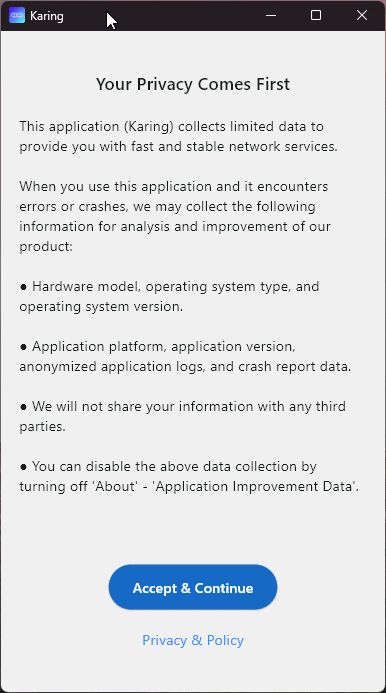

<p align="center">
  
</p>


# 🚀 Настройка Karing

Быстрая настройка конфигурации для разных устройств. 

---

### 📚 Подробная инструкция
[](https://karing-backup.netlify.app/) [](https://telegra.ph/Instrukciya-po-nastrojke-prilozheniya-Karing-03-07)

---
### 📋 Ссылки для импорта
*Нажмите на иконку копирования (справа в углу блока), чтобы получить ссылку:*

**📱 Mobile:**
```text
https://github.com/Sn1pp1/karing_backup/releases/download/latest/Karing_mobile.zip
```
**💻 Windows:**
```text
https://github.com/Sn1pp1/karing_backup/releases/download/latest/Karing_windows.zip
```
📂 Краткая инструкция:

1. Откройте Karing → Settings → Backup and Sync (Karing → Настройки → Резервное копирование и синхронизация).

2. Нажмите Import and Export → Import from URL (Импорт и экспорт в файл → Импорт из URL).

3. Вставьте скопированную ссылку и нажмите OK.

<div align="center">
  
</div>
