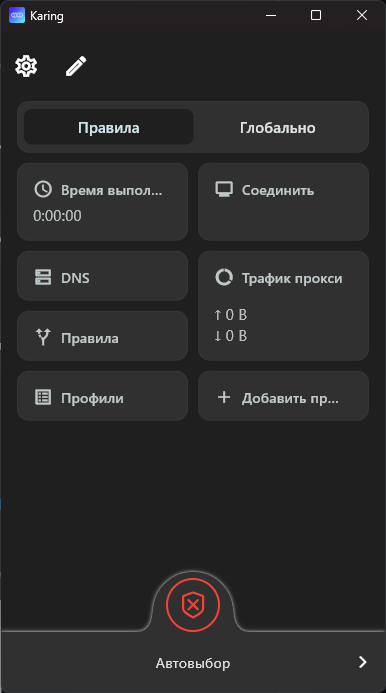

## 📥 Скачать Karing

<details>
<summary style="background: linear-gradient(90deg, transparent 0%, #1f2937 50%, transparent 100%); border-top: 2px solid #58a6ff; border-bottom: 2px solid #58a6ff; color: #58a6ff; padding: 14px; cursor: pointer; font-weight: 600; text-align: center;">
✦ ✦ &nbsp; <b>📥 СКАЧАТЬ KARING</b> &nbsp; ✦ ✦ <br><span style="font-size: 0.85em; font-weight: 400;">Нажмите, чтобы показать все платформы для скачивания 🔽</span>
</summary>

<div style="padding: 20px; background: #161b22; border: 2px solid #667eea; border-top: none; border-radius: 0 0 8px 8px;">

### 💻 Компьютеры

| Платформа | Ссылка | Описание |
|-----------|--------|----------|
| 🪟 **Windows** | [Installer (.exe)](https://dot.karing.app/client.html?tag=windows-installer-stable) | Обычная установка |
| 🍎 **macOS** | [Universal (.dmg)](https://dot.karing.app/client.html?tag=macos-stable) | Для всех Mac |
| 🐧 **Linux** | [.deb](https://dot.karing.app/client.html?tag=linux-deb-stable) / [.rpm](https://dot.karing.app/client.html?tag=linux-rpm-stable) | Debian/Ubuntu или Fedora |

---

### 📱 Мобильные устройства

| Платформа | Ссылка | Описание |
|-----------|--------|----------|
| 🤖 **Android** | [Phone/Tablet](https://dot.karing.app/client.html?tag=android-stable) | Современные смартфоны |
| 📺 **Android TV** | [TV/Box](https://dot.karing.app/client.html?tag=android-armv7a-stable) | Телевизоры и приставки |
| 📱 **iOS** | [App Store](https://apps.apple.com/us/app/karing/id6472431552) | iPhone/iPad |

---

### 🔗 Другие варианты

- 🐙 [**GitHub Releases**](https://github.com/KaringX/karing/releases/latest) — все версии и платформы
- 🌐 [**Официальный сайт**](https://karing.app/en/download)

> 💡 **Совет:** Если не знаете, что выбрать — скачивайте с GitHub Releases

</div>
</details>

# 🚀 Настройка Karing

Быстрая настройка конфигурации для разных устройств. 

---

### 📚 Пошаговое руководство для первой настройки приложения.
[](https://karing.netlify.app/)

---
### 📋 Ссылки для импорта
*Нажмите на иконку копирования (справа в углу блока), чтобы получить ссылку:*

**📱 Mobile:**
```text
https://github.com/Sn1pp1/karing_backup/releases/download/latest/Karing_mobile.zip
```
**💻 Desktop (Windows):**
```text
https://github.com/Sn1pp1/karing_backup/releases/download/latest/Karing_desktop.zip
```
📂 Краткая инструкция:

1. Откройте Karing → Settings → Backup and Sync (Karing → Настройки → Резервное копирование и синхронизация).

2. Нажмите Import and Export → Import from URL (Импорт и экспорт в файл → Импорт из URL).

3. Вставьте скопированную ссылку и нажмите OK.

<div align="center">
  
</div>
